
<h1>Rover Sensors</h1>

## Overview
A prototype of a rover that can be used to collect data, in order to determine the habitability of a planet.

## Sensors
This rover contains the following sensors:
* Temperature-Humidity
* Gas
* Light
* Pressure and Altitude
* Air Quality
* UV
* GPS
* Geiger Radiation Counter

As well as an ESP-8266 Wi-Fi module for data transmission. 
These sensors and the Wi-Fi module are connected to an Arduino Mega (an Arduino Uno is also used between the Geiger Counter and the Arduino Mega). The Arduino in turn transmits the data, via some PHP files, to a database.

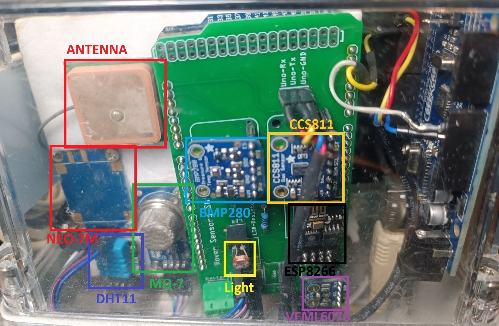

## Database
The data of the sensors are stored on a MySQL database, currently on a shared hosting service.

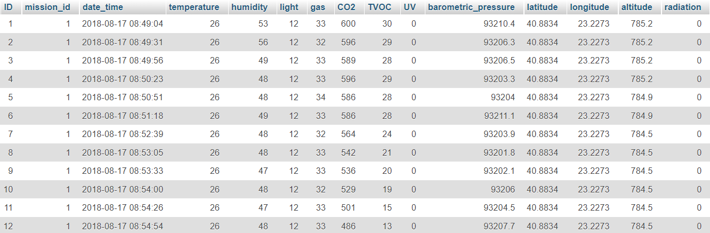

The communication with the database is achieved via some [PHP files](RoverSensorsWeb/data_json.php), hosted on the website, which have access to database. 

## Website ([Link](http://pliamprojects.000webhostapp.com/rover))

The data can be accesed using the website, in the following way:

First, the user selects the mission, given a list of all available missions and their information. 
Then, on the home page, there is the following information:
* The average value for each type of data
* Information about the planet
* Its habitability based on the data collected
* Gauges that show the last value of each sensor
* The route of the rover in a map

For the website, I used VS Code and it was written in HTML, CSS, and JavaScript. 
([Source code](roversensorsweb/data.php))

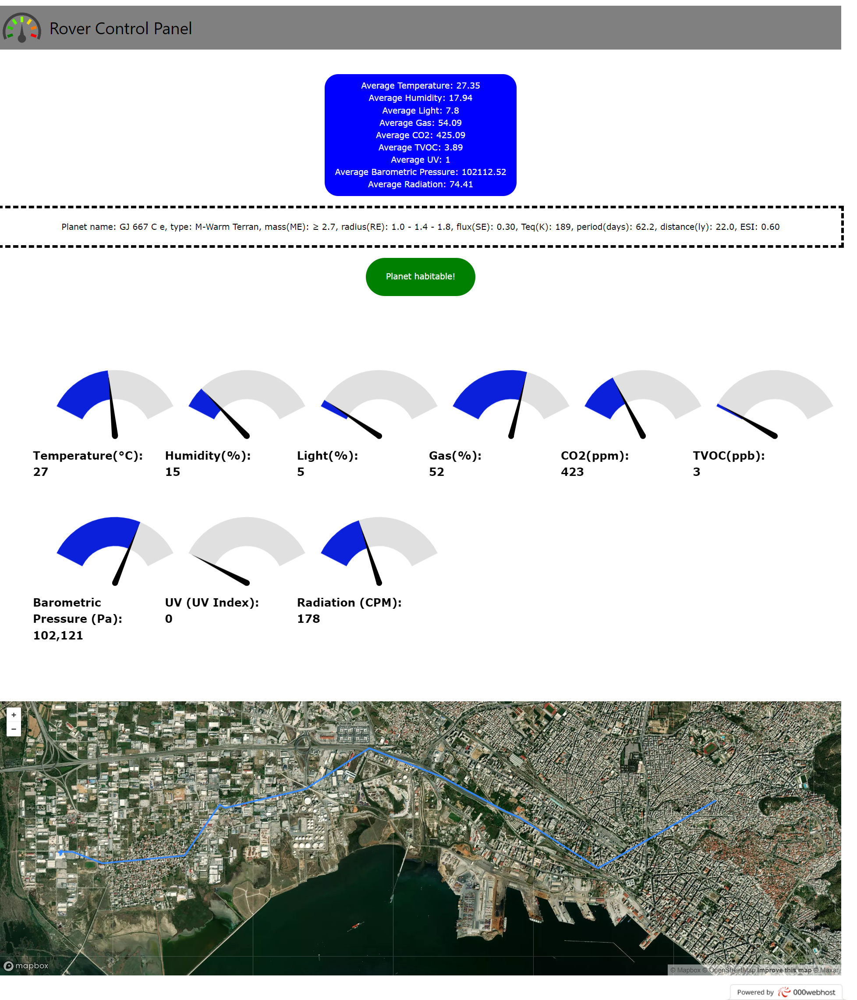

## Android Application ([Google Play](https://play.google.com/store/apps/details?id=com.pliamdev.pliam.roversensors))

I also made an Android application (using Android Studio) to access the sensors' data:

* First, the user selects a mission from a list retrieved from the database.
* The basic screen of the app is the page with the graphs.
* Another basic part of the app is the planet information page, where the user can view some information about the planet targeted by the mission (with links to the explanation of the data displayed), as well as the habitability of the planet based on the data retrieved by the rover.
* There is also a page where the user can view the rover’s location and route during the mission, retrieved from the database

([Source Code](RoverSensorsAndroid))

    
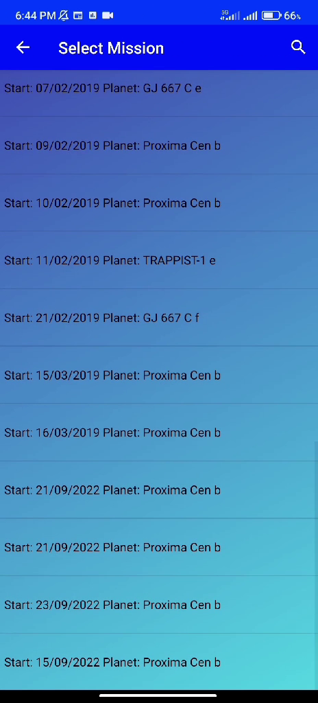

    
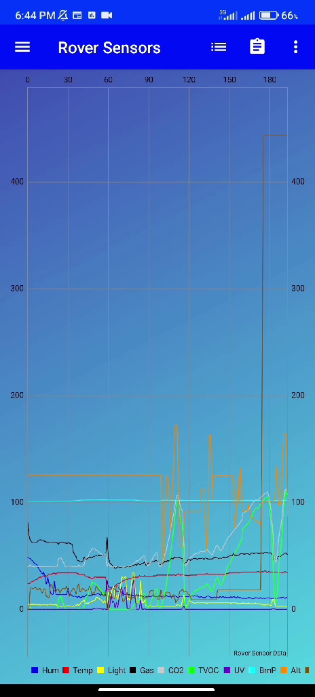

    
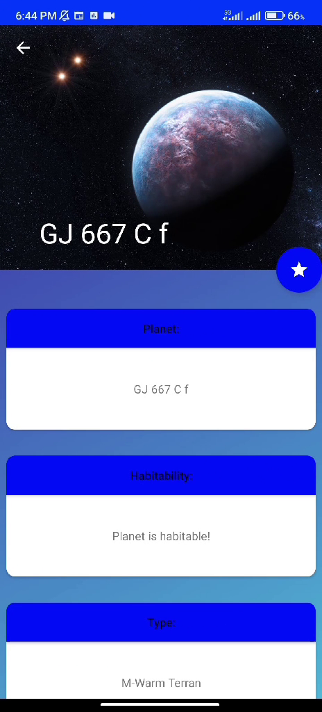

    
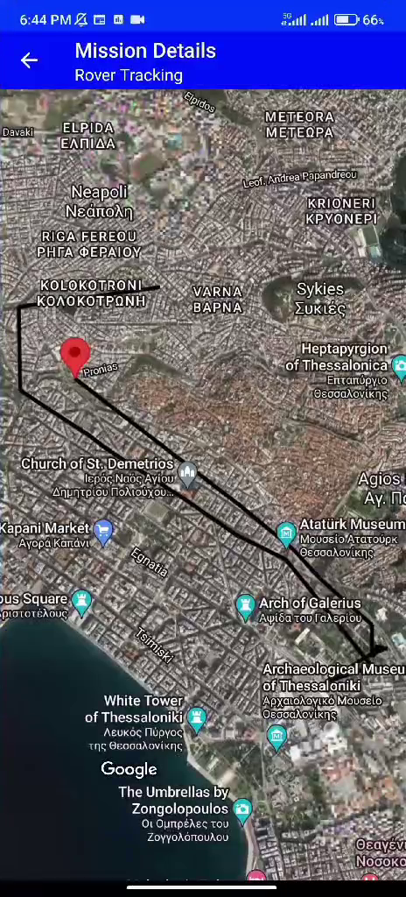

## Windows Application ([Microsoft Store](https://apps.microsoft.com/store/detail/rover-sensors/9PBLZ7BN15H7))
I created a UWP (Universal Windows Platform) Windows application, to view the data of the sensors, with Visual Studio. Its structure is the following (quite similar to the android application):
* The page where the user selects a mission to view the data for
* A page where the sensors’ data are displayed in graphs 
* The page where the user can view information about the planet as well as its habitability
* The page where the user can view the rover’s route

There is also the home page, where there is a dashboard containing all the above pages together.

([Source Code](RoverSensorsWindows))

    

        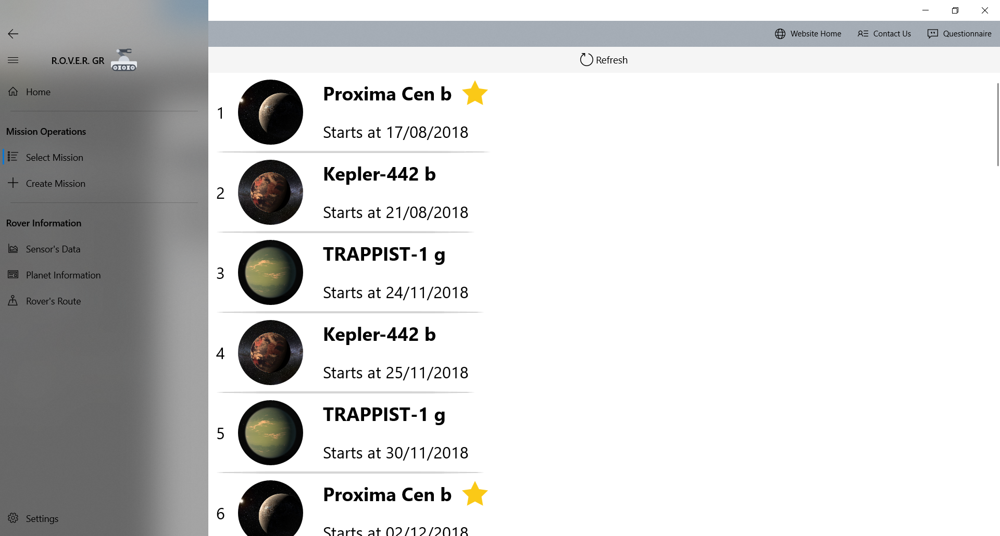
        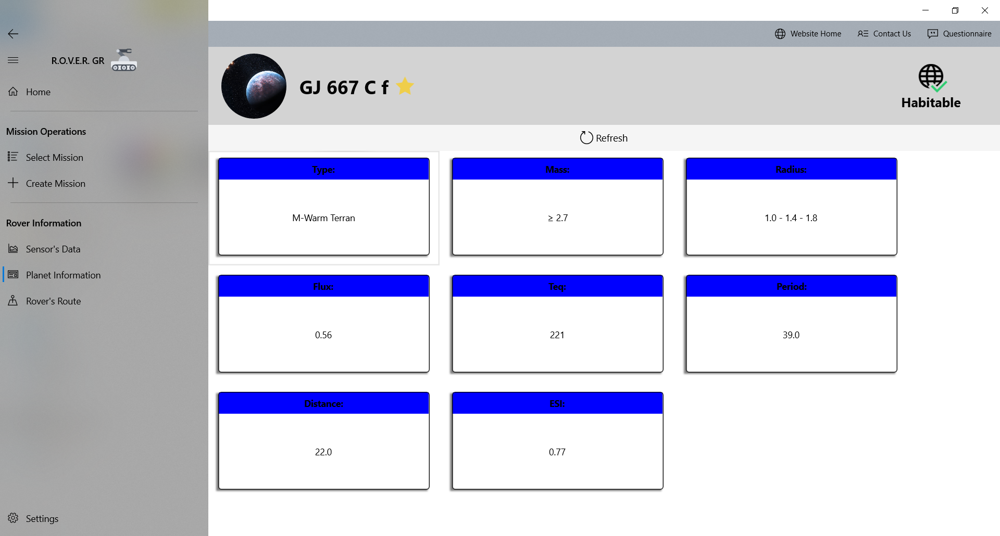
    

    

        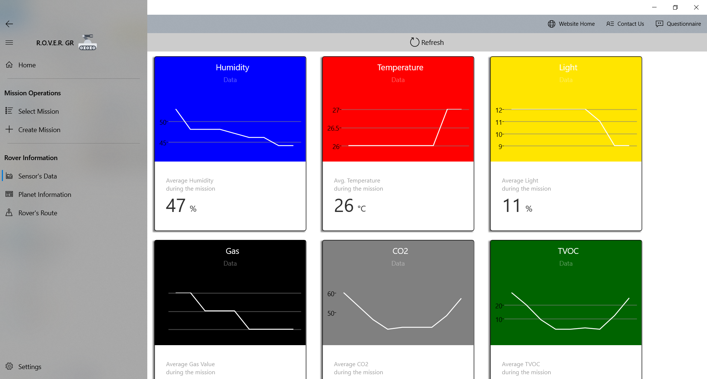
        
    

 

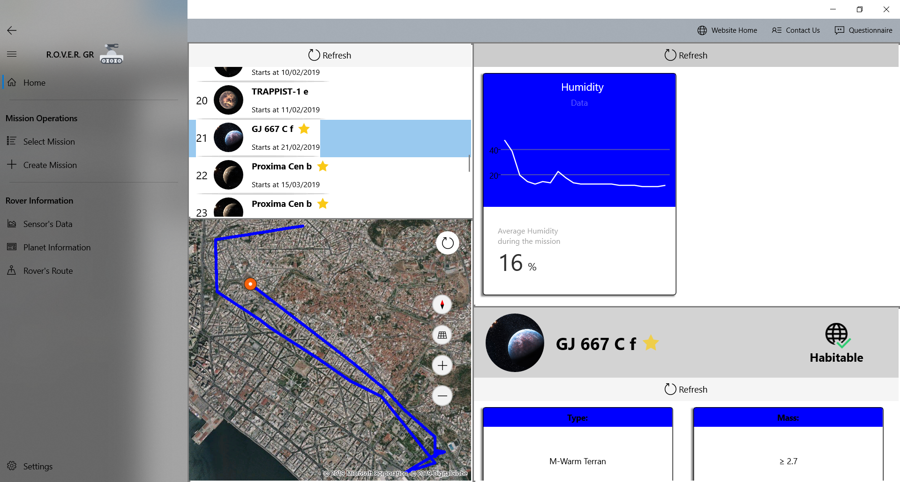

 

<ms-store-badge productid="9PBLZ7BN15H7" animation="on"></ms-store-badge>

